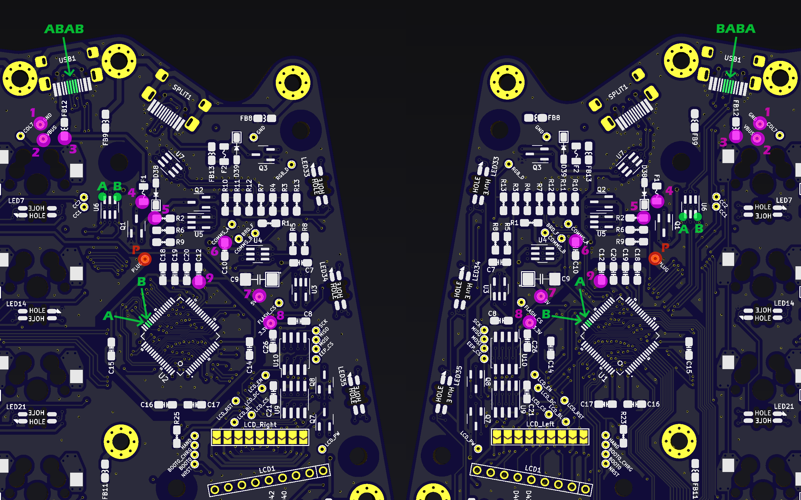

# Troubleshooting

This should hopefully help troubleshoot issues with getting the Djinn up and running.

## Initial steps

- Check that 1 & 2 aren't shorted together
- Check that the A's and B's aren't shorted together
- Check that the A's are all connected
- Check that the B's are all connected
- Measure 1-2 with multimeter, should be 5V
- Measure 1-3 with multimeter, should be 5V
- Measure 1-4 with multimeter, should be 5V
- Measure 1-5 with multimeter, should be 5V
- Measure 1-6 with multimeter, should be 5V
- Measure 1-7 with multimeter, should be 5V
- Measure 1-8 with multimeter, should be 3.3V
- Measure 1-9 with multimeter, should be 3.3V
- Measure 1-P with multimeter, should be 3.3V if connected to USB, 0V if not connected to USB